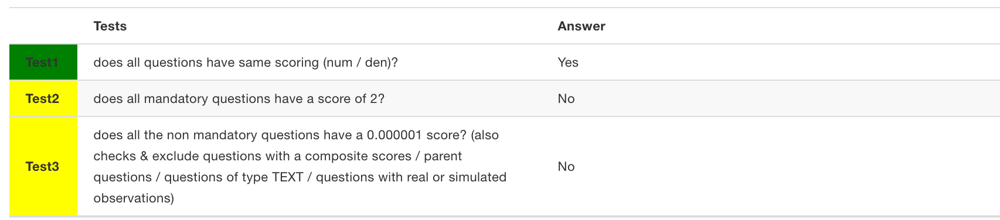
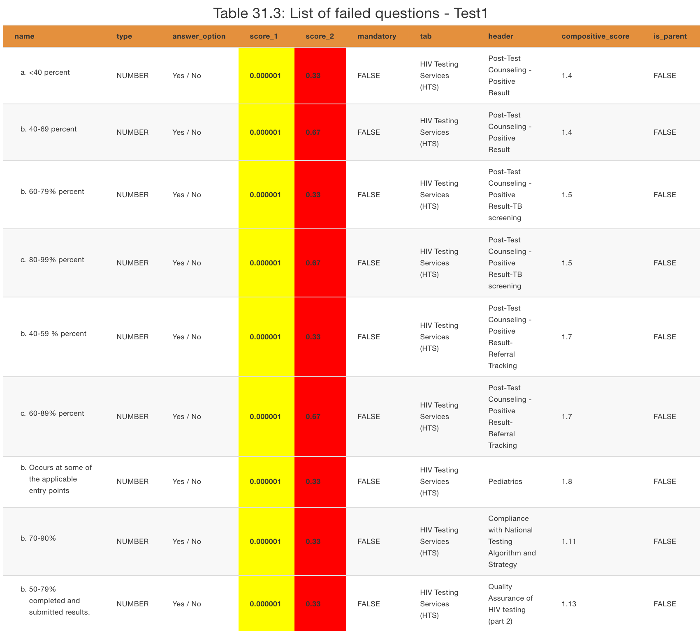

--- 
title: "HNQIS Scoring Test Report"
author: "HNQIS Core Team"
date: "`r Sys.Date()`"
site: bookdown::bookdown_site
documentclass: book
bibliography: [book.bib, packages.bib]
biblio-style: apalike
link-citations: yes
description: "A scoring test report for HNQIS"
---

# How to read this report {-}

## Scope of tests {-}

For each checklist, we perform three tests: 

- `Test 1` - to determine whether a list has the same scoring on both numerators and denominators, i.e., score_1, score_2.
- `Test 2` - to determine whether mandatory questions have a scoring of `2`.
- `Test 3` - to determine whether all the non-mandatory questions have a scoring of `0.000001`. Here, there are a few exceptions; questions with composite scores (sections), the parent questions, questions of type `TEXT,` and questions with a real or simulated observation.

## Interpreting the tests {-}

```{r echo=FALSE, fig.cap="Example of a test result"}

```

All these tests will answer either `Yes` / `No` once the tests are completed: 

- `Yes` - indicates `pass,` and the answer is highlighted in yellow.
- `No`- indicates `worth questioning.` This doesn't necessarily mean a failed test; there could be issues that need to be double-checked with a close eye. Usually, a table showing the lists of "failed questions" will be presented next to it. If not present, this means that we've hidden the exempted questions or there is nothing to double check. Meaning, the test actually passed.

## Interpreting the listed questions {-}

The table presents questions by: 

- `name` - how they appear on the App.
- `type` - indicating their format.
- `answer_option` - their answer options, mostly `Yes/No`.
- `score_1` - the numerator score.
- `score_2` - the denominator score.
- `mandatory` - whether a critical or a none critical question. `TRUE` or `FALSE`
- `tab` - the tab where they are located in the form/template/App.
- `header` - their section in the form/template/App.
- `compositive_score` - whether they contribute to the scoring or not. If yes, it should be specified. 
- `is_parent` - is it a parent question? `TRUE` or `FALSE.`

`score_1` is highlighted in `yellow` when the scores are correct (test 3 is pass) and `red` when they are not correct (test 3 failed).

`score_2` is always highlighted in `green` if the questions have the same scoring (passed test 1) and `red` if they don't - a worry for the dev team. 

see below example. 

```{r echo=FALSE, fig.cap="Example of a table with failed questions"}

```


```{r setup, include=FALSE}
knitr::opts_chunk$set(echo = TRUE, message = FALSE, warning = FALSE)

## Scripts
library(gsheetr)
library(httr)
library(jsonlite)
library(magrittr)
library(kableExtra)
library(knitr)
library(dplyr)
library(lubridate)

# Load all checklist 
all_checklists_cred <- readr::read_csv("/Users/isaiahnyabuto/Documents/Workspace/HNQIS/lists/HNQIS lists gen diagnosis.csv") %>%
  dplyr::filter(., `Needs a scoring update?` != "Not sure") %>%
  dplyr::arrange(., country) %>%
  dplyr::select(server,demo_account,demo_pw) %>% 
  unique(.)

# prepare to login 
login_d <- vector("logical", length = nrow(all_checklists_cred))

for (i in seq_along(1:nrow(all_checklists_cred))){
  login_d[i] <- login_dhis2(baseurl = all_checklists_cred$server[i],
                            usr = all_checklists_cred$demo_account[i],
                            pwd = all_checklists_cred$demo_pw[i])
}

# tryCatch({
#   for (i in seq_along(1:nrow(all_checklists_cred))){
#   login_d[i] <- login_dhis2(baseurl = all_checklists_cred$server[i],
#                             usr = all_checklists_cred$demo_account[i],
#                             pwd = all_checklists_cred$demo_pw[i])
# }
# },error = function(e){})


# baseurl <- "https://staging.psi-mis.org/"
# base <- substr(baseurl, 9,27)
# 
# gsheetr::login_dhis2(baseurl,
#                      usr = keyringr::get_kc_account(base, "internet"), 
#                      pwd = keyringr::decrypt_kc_pw(base, "internet"))

hnqis_scoring_form <- function(form_id, baseurl){
  
  # Get form
  hnqis_form <- GET(paste0(baseurl, "api/programs/", form_id)) %>%
  content(., 'text') %>%
  fromJSON(.)
  
  # Get the hnqis list id
  hnqis_list_id <- hnqis_form$programStages$id
  
  # Get questions in the hnqis list
  hnqis_list_questions <- GET(paste0(baseurl, "api/programStages/", hnqis_list_id, "?fields=programStageDataElements[compulsory,dataElement[id,formName,valueType,optionSet[options[name]],attributeValues[*]]")) %>%
  content(., "text") %>%
  fromJSON(.) %>%
  .$programStageDataElements
  
  # do some cleaning
  hnqis_list_cleaned_questions <- hnqis_list_questions %>%
  dplyr::mutate(name = .$dataElement$formName,
                type = .$dataElement$valueType,
                answer_option = purrr::map_chr(.$dataElement$optionSet$options, function(x){
                  ifelse(!is.null(x), slash(x), "")
                }), 
                des_attributes = purrr::map_df(.$dataElement$attributeValues, ~flatten_attributes(.x)), 
                score_1 = des_attributes$l7WdLDhE3xW,
                score_2 = des_attributes$Zyr7rlDOJy8, 
                tab = des_attributes$HzxUdTtqy5c,
                header = des_attributes$olcVXnDPG1U,
                compositive_score = des_attributes$k738RpAYLmz,
                #compulsory = purrr::map_chr(.$compulsory, ~ifelse(.x == "TRUE", "Yes", "No")),
                parent_id = 
                  if(any(names(des_attributes) %in% "jeZmx9zUd5p")){
                    des_attributes$jeZmx9zUd5p
                  } else{
                    rep("", nrow(des_attributes))
                  },
                question_id = .$dataElement$id, 
                is_parent = ifelse(question_id %in% unique(parent_id), T, F)) %>%
  dplyr::select(name,type,answer_option,score_1,score_2,compulsory,tab,header,compositive_score, is_parent) %>%
  dplyr::rename(mandatory = compulsory) %>% 
  dplyr::mutate_all(~replace(., is.na(.), ""))
  
  hnqis_list_cleaned_questions
}

slash <- function(df){
  if (names(df) == "name"){
    paste0(df$name, collapse = " / ")
  }
}

flatten_attributes <- function(df){
  
  if (all(c("value","attribute") %in% names(df))){
    df <- dplyr::mutate(df, attribute = df$attribute$id)
    df_wider <- df %>%
      unique(.) %>%
      tidyr::pivot_wider(., names_from = attribute, values_from = value) %>% 
      dplyr::filter(across(any_of("lastUpdated"), ~as_date(.x) == max(as_date(.x)))) %>% #, as_date(lastUpdated) == max(as_date(lastUpdated))) %>%
      dplyr::select(-one_of("lastUpdated","created")) %>%
      unique()
    df_wider
  }
}
# Test that all questions have the same scoring

test_same_scoring <- function(df){
  
  if (all(c("score_1", "score_2") %in% names(df))){
    passed <- df$score_1 == df$score_2
    # return a helpful object 
    result <- structure(
      list(answer = ifelse(all(passed), "Yes", "No"),
           failed = dplyr::filter(df, !passed)), 
      class = "test_same_scoring"
    )
    
    result
    
  }
}

# Test Mandatory scoring 
test_mandatory_scoring  <- function(df, score = "2"){
  
  if (all(c("mandatory", "score_1") %in% names(df))){
    df_mandatory <- dplyr::filter(df, mandatory == T)
    passed <- df_mandatory$score_1 == score 
    
    # return a helpful obj
    result <- structure(
      list(answer =  ifelse(all(passed), "Yes", "No"),
           failed = dplyr::filter(df_mandatory, !passed)),
      class = "test_mandatory_scoring"
    )
    result
  }
}

# Test non mandatory
test_none_mandatory_scoring <- function(df, score = "0.000001", ignore_text = F, ignore_parent = F, ignore_real_or_simulated = F){
  
  if (all(c("compositive_score","score_1") %in% names(df))){
    
    df_non_mandatory <- dplyr::filter(df, mandatory == F)
    
    passed <- df_non_mandatory$compositive_score != "" & df_non_mandatory$score_1 == score
    
    # & df_non_mandatory$tab != "Composite Scores" & df_non_mandatory$name != "" & df_non_mandatory$type != "TEXT" & df_non_mandatory$is_parent != T & df_non_mandatory$answer_option !=  "Real / Simulated"
    
    failed <- df_non_mandatory %>%
      dplyr::filter(!passed & tab != "Composite Scores" & name != "")
    
    if (ignore_text){
      failed <- failed %>%
        dplyr::filter(., type != "TEXT")
    }
    
    if (ignore_parent){
      failed <- failed %>%
        dplyr::filter(., is_parent != T)
    }
    
    if (ignore_real_or_simulated){
      failed <- failed %>%
        dplyr::filter(., answer_option != "Real / Simulated") %>%
        dplyr::filter(., answer_option != "Réelle / Simulée")
    }
    
    
    
    
    # %>%
    #   dplyr::filter(tab != "Composite Scores") %>%
    #          dplyr::filter(name != "")
    
    # dplyr::filter(df_non_mandatory, !passed) %>%
    #          dplyr::filter(tab != "Composite Scores") %>%
    #          dplyr::filter(name != "")
    
    # return a helpful obj
    result <- structure(
      list(answer = ifelse(all(passed), "Yes", "No"),
           failed = failed),
      class = "test_none_mandatory_scoring"
    )
    
    result
  }
}


#' @param form_id Checklist ID
#' @param baseurl Server 
#' @param ... Additional parameters passed to the test_none_mandatory_scoring.
test_scoring_update <- function(form_id, baseurl, ...){
  
  scoring_form <- hnqis_scoring_form(form_id = form_id, baseurl = baseurl)
  
  # run tests 
  test_results <- structure(
    list(
      Test1 = list(
      name = "does all questions have same scoring (num / den)?",
      results = test_same_scoring(scoring_form)
      ),
      Test2 = list(
      name = "does all mandatory questions have a score of 2?",
      results = test_mandatory_scoring(scoring_form)
      ),
      Test3 = list(
      name = "does all the non mandatory questions have a 0.000001 score? (also checks & exclude questions with a composite scores / parent questions / questions of type TEXT / questions with real or simulated observations)",
      results = test_none_mandatory_scoring(scoring_form, ...)
      ))
    )
    

  results_df <- data.frame(
    Tests = purrr::map_chr(test_results, ~purrr::pluck(., 1)),
    Answer = purrr::map_chr(test_results, ~purrr::pluck(., 2, 1)),
    stringsAsFactors = F
  )
  

  
  # any that failed?
  if (any(results_df$Answer == "No")){
    
    failed_tests <- purrr::map(test_results, ~purrr::pluck(., 2,2))
    
     results <- structure(
      list(results = results_df,
           failed_tests = failed_tests),
      class = "test_results"
    )

  } else {
      results <- structure(
      list(results = results_df),
      class = "test_results"
    )
  }
  
  results

  
}


#' Generate Kable 1 
#' @param form_id The checklist ID
#' @param baseurl The server URL.
generate_kable_1 <- function(form_id, baseurl){
  scoring_form <- test_scoring_update(form_id = form_id, baseurl = baseurl)
  
  # scoring_form$results <- dplyr::mutate(
  #   scoring_form$results,
  #   Answer = cell_spec(Answer,
  #                      color = ifelse(Answer == "Yes", "#377E2A",
  #                                     "#377E2A"))
  # )
  
  # scoring_form$results$Answer = cell_spec(scoring_form$results$Answer,
  #                                         color = ifelse(
  #                                           scoring_form$results$Answer == "Yes", "#377E2A","#377E2A"))

  kable(scoring_form$results, booktabs = T, escape = F, linesep = "") %>%
    kable_styling(bootstrap_options = c("striped"), full_width = T, font_size = 10) %>%
    column_spec(1, width = "1cm", background = ifelse(scoring_form$results$Answer == "Yes","green","yellow"), 
                bold = T) %>% 
    column_spec(2, width = "11cm") %>%
    column_spec(3, width = "11cm") 
}

#' Generate Kable 2
#' @param form_id The checklist ID
#' @param baseurl The server URL.
#' @param ... Additional params passed to the test_non_mandatory
generate_kable_2 <- function(form_id, baseurl, ...){
  
  scoring_form <- test_scoring_update(form_id = form_id, baseurl = baseurl, ...)
  
  purrr::imap(scoring_form$failed_tests, function(.x, .y){
  if (dim(.x)[1] > 0){
    
    kable(.x, booktabs = T, caption = paste("List of failed questions - ", .y), escape = F, linesep = "") %>%
      kable_styling(bootstrap_options = c("striped", "hover", "responsive"), font_size = 8, fixed_thead = list(enabled = T, background = "#E4903D")) %>% 
      column_spec(1, width = "3cm") %>% 
      column_spec(2, width = "1cm") %>% 
      column_spec(3, width = "2cm") %>% 
      column_spec(4, width = "0.5cm", background = ifelse(.x$score_1 != "0.000001" & .x$mandatory == F & .x$is_parent == F,
                                                          "red","yellow"), bold = T) %>%
      column_spec(5, width = "0.5cm", background = ifelse(.x$score_1 == .x$score_2,
                                                          "green","red"), bold = T) %>% 
      column_spec(6, width = "0.5cm") %>% 
      column_spec(7, width = "2cm") %>%
      column_spec(8, width = "1cm") %>% 
      column_spec(9, width = "1cm") %>%
      column_spec(10, width = "0.7cm")
  }
  }) -> output1

  purrr::map_lgl(output1, is.null) -> no_fails
  
  #length(output1) != 0 || length(output1[!no_fails]) != 0
  
  if (length(output1[!no_fails]) != 0){
    purrr::pluck(output1[!no_fails], 1)
  }

  #purrr::pluck(output1[!no_fails], 1)
  #output1
}


```


```{r include=FALSE}
# automatically create a bib database for R packages
knitr::write_bib(c(
  .packages(), 'bookdown', 'knitr', 'rmarkdown'
), 'packages.bib')
```
